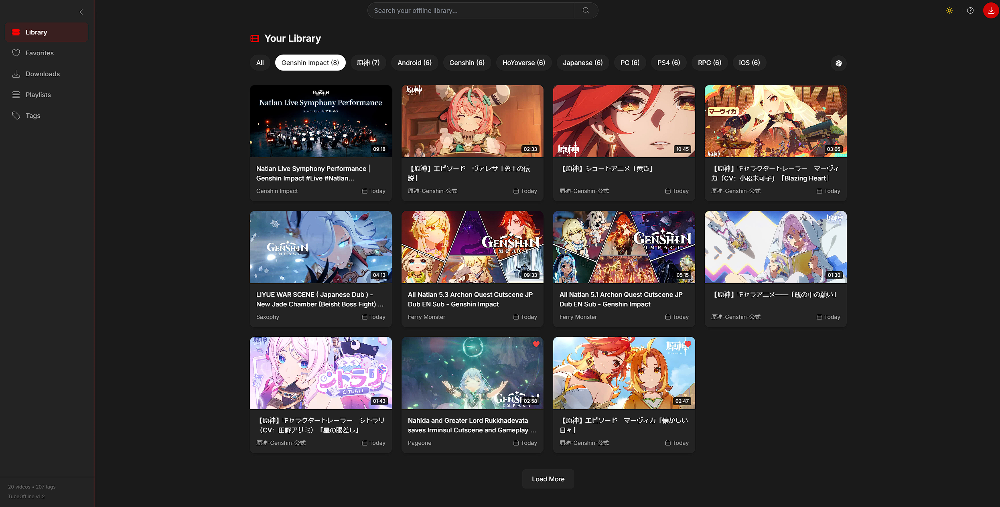
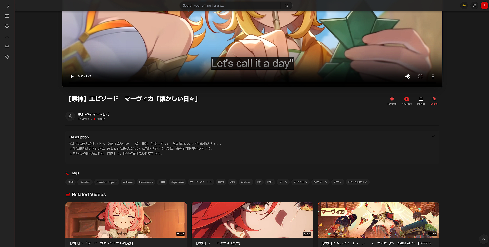

# TubeOffline - YouTube Offline Library

An elegant offline YouTube video library using YT-DLP with a React frontend and Express backend.





## Table of Contents
- [Disclaimer](#-disclaimer--ai-generated-project-warning)
- [Features](#features)
- [Running with Docker](#running-with-docker-recommended)
- [Manual Installation](#manual-installation)
- [Production Build](#production-build)
- [Configuration](#configuration)
- [Updating](#updating)
- [Tech Stack](#tech-stack)
- [License](#license)

## ⚠️ Disclaimer / AI-Generated Project Warning

**This project was mostly coded using AI (Claude 3.7 Sonnet Thinking).**

This code is provided as-is. While effort has been made to ensure functionality, it comes with no warranty or guarantee of support.

**Please note:**

- Use of this code is at your own risk.
- No official support will be provided for setup, usage, customization, or troubleshooting.
- Community contributions and improvements via pull requests are welcome, but please do not expect personalized assistance.

For any issues or questions, consider consulting online resources, community forums, or attempting to resolve problems independently.

## Features

- Download and store YouTube videos locally using YT-DLP
- Beautiful library interface to browse and watch offline videos
- Create and organize playlists
- Automatic English subtitle downloading when available
- Metadata extraction and tag-based browsing
- High-quality video playback with subtitle support
- Real-time download progress updates
- Search functionality for your offline library
- Theme switcher with light and dark mode
- Keyboard shortcuts for playback control

## Running with Docker (Recommended)

The easiest way to run TubeOffline is using Docker:

1. Make sure you have [Docker](https://docs.docker.com/get-docker/) and [Docker Compose](https://docs.docker.com/compose/install/) installed

2. Clone the repository:
   ```bash
   git clone https://github.com/Eidenz/tube-offline.git
   cd tube-offline
   ```

3. Make the management script executable and start the application:
   ```bash
   chmod +x tubeoffline.sh
   ./tubeoffline.sh start
   ```

4. Access TubeOffline in your browser at http://localhost:5000 (or your custom port if configured)

For more details on using Docker, see [README-Docker.md](README-Docker.md).

## Manual Installation

### Prerequisites

- [Node.js](https://nodejs.org/) (v14 or higher)
- [npm](https://www.npmjs.com/) (v6 or higher)
- [yt-dlp](https://github.com/yt-dlp/yt-dlp) (must be installed and in your PATH)

### Installing yt-dlp

#### Windows
```
winget install yt-dlp
```
or download from https://github.com/yt-dlp/yt-dlp/releases and add to PATH

#### macOS
```
brew install yt-dlp
```

#### Linux
```
sudo curl -L https://github.com/yt-dlp/yt-dlp/releases/latest/download/yt-dlp -o /usr/local/bin/yt-dlp
sudo chmod a+rx /usr/local/bin/yt-dlp
```

### Installation

1. Clone the repository:
```bash
git clone https://github.com/Eidenz/tube-offline.git
cd tube-offline
```

2. Install dependencies:
```bash
npm install
```

3. Start the development server:
```bash
npm run dev
```

This will start both the frontend (Vite) and backend (Express) servers concurrently.

- Frontend: http://localhost:3000
- Backend: http://localhost:5000

## Production Build

To create a production build:

```bash
npm run build
```

The built files will be in the `dist` directory. To serve these files along with the backend:

```bash
npm start
```

## Configuration

You can modify the server configuration in `.env`:

- `PORT`: Backend server port (default: 5000)
- `DATA_DIR`: Directory to store all data (database, videos, thumbnails, subtitles)
- `DEFAULT_VIDEO_QUALITY`: Default video quality for downloads
- `DOWNLOAD_SUBTITLES`: Whether to download subtitles by default
- `MAX_CONCURRENT_DOWNLOADS`: Maximum number of concurrent downloads

## Updating

### Docker Method (Recommended)

To update TubeOffline to the latest version:

```bash
./tubeoffline.sh update
```

This will automatically:
1. Pull the latest code from the repository
2. Rebuild the Docker container
3. Restart the application with the updated version

### Manual Update

If you're running the application manually:

```bash
# Pull the latest changes
git pull

# Install any new dependencies
npm install

# Rebuild the application
npm run build

# Restart the server
npm start
```

## Tech Stack

### Frontend
- React
- React Router Dom
- Framer Motion for animations
- Tailwind CSS for styling
- Vite for development and building
- React Player for video playback
- Axios for API requests
- React Beautiful DnD for drag-and-drop playlist management

### Backend
- Express.js
- Better-SQLite3 for database
- yt-dlp for YouTube downloading
- WebSockets for real-time updates

## License

MIT
